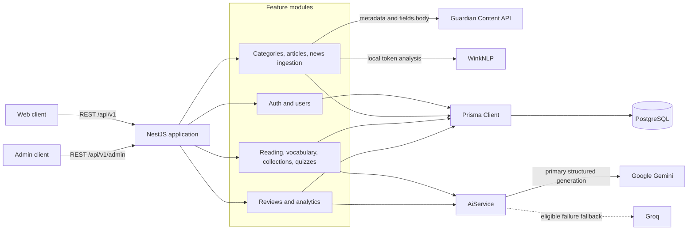
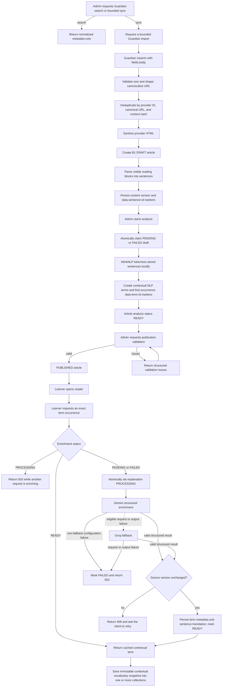

# Vocab Mate Backend

Vocab Mate is a REST API for learning English vocabulary through news articles. It supports curated and Guardian-imported content, contextual vocabulary lookup, saved vocabulary collections, quizzes, adaptive review sessions, and learner/admin analytics.

The backend combines deterministic language processing and server-owned learning rules with bounded LLM workflows. Local WinkNLP analysis identifies contextual term occurrences; Gemini and Groq provide structured term enrichment, review-question generation, optional session planning, and selective answer diagnosis.

## Highlights

- Versioned NestJS API with Swagger/OpenAPI, runtime DTO validation, consistent feature-response envelopes, CORS credentials, and role-based access control.
- PostgreSQL data model for versioned article content, contextual term occurrences, immutable saved-vocabulary snapshots, quizzes, review sessions, spaced-repetition state, and AI decision audits.
- Admin-controlled content lifecycle: import or create, sanitize, parse, analyze, moderate, preview, publish, archive, and restore.
- Guardian Content API integration with bounded responses, canonical URLs, duplicate detection, HTML sanitization, per-item failure isolation, and no publisher-page scraping.
- Lazy contextual-term enrichment with atomic work claiming, Gemini-to-Groq fallback, strict output validation, failure states, and exact-term caching.
- Adaptive review agent with cached AI questions, duration-aware daily plans, deterministic grading and scheduling, bounded AI call budgets, rule fallback, and auditable interventions.
- Learner and admin analytics over vocabulary, reading, quizzes, reviews, content, and user activity.

## Technology stack

| Area | Implementation |
| --- | --- |
| Runtime and API | Node.js, TypeScript, NestJS 11, Express |
| API contract | `@nestjs/swagger`, URI versioning, `class-validator`, `class-transformer` |
| Authentication | Passport JWT, `@nestjs/jwt`, BCrypt, HttpOnly cookies |
| Database | PostgreSQL, Prisma 7, `@prisma/adapter-pg`, `pg` |
| AI providers | Google Gemini via `@google/genai`; Groq fallback via `groq-sdk` |
| Local NLP | `wink-nlp` with `wink-eng-lite-web-model` |
| Content processing | `sanitize-html`, `htmlparser2`, `domhandler` |
| Testing | Jest, Nest testing utilities, Supertest |

## System architecture



`AppModule` composes feature modules. Controllers own HTTP concerns; services own application rules; most feature repositories own Prisma access. `ConfigModule` and `PrismaModule` are global. Analytics is intentionally query-heavy and accesses the shared `PrismaService` directly.

All application routes use the `/api` global prefix and URI version `1`. A global `ValidationPipe` transforms DTO values and rejects unexpected fields through `whitelist: true` and `forbidNonWhitelisted: true`.

## Content intelligence workflow

The content pipeline is synchronous and admin-controlled. Import, parsing, local analysis, and publication never run automatically in the background.



### Guardian ingestion

- `GET /api/v1/admin/news/search` requests normalized metadata only. It does not request or return article bodies.
- `POST /api/v1/admin/news/sync` requests up to 10 articles through Guardian's official `/search` endpoint with `fields.body`. Each result is imported independently.
- The client enforces a 10-second timeout, a 2 MB response limit, a maximum page size of 10, one retry path for eligible upstream/network failures, and a process-local one-second interval between request starts.
- Imported HTML must contain at least 500 plain-text characters after sanitization. Placeholder or unusable content fails safely.
- The backend never fetches a Guardian article's public `webUrl` and has no scraping fallback.
- Duplicate protection uses partial unique indexes for `(import_source, external_id)`, `canonical_url`, and a normalized SHA-256 `content_hash`.
- A supplied active category is used when present. Otherwise, the Guardian section is matched to an active category or used to create one. Imported drafts start at CEFR `B1` with analysis status `PENDING`.

### Parsing and local analysis

`SentenceParserHelper` removes stale sentence/term markers, segments English text with `Intl.Segmenter`, persists sentence rows for the current `contentVersion`, and inserts stable `data-sentence-id` spans into supported reading blocks. Article HTML is sanitized separately before parsing.

`POST /api/v1/admin/articles/:articleId/analyze` is local NLP, not an LLM call. It:

1. Accepts only parsed `DRAFT` articles whose analysis status is `PENDING` or `FAILED`.
2. Atomically claims the current article/content version as `PROCESSING`.
3. Uses WinkNLP to accept English `word` tokens with stable whole-word matches.
4. Deduplicates normalized surfaces within each sentence and skips surfaces already covered by a term.
5. Creates sentence-contextual terms with origin `NLP`, review status `APPROVED`, active lookup enabled, and explanation status `PENDING`.
6. Inserts one `data-term-id` marker at the first accepted occurrence and commits only if the source HTML, content version, sentences, and term inventory are unchanged.

Changing article HTML increments `contentVersion` and invalidates the previous parsed cache atomically. Publication validates sanitized HTML, current sentence/term marker integrity, active category and sentences, term state, and at least one active lookup term. Pending or failed lazy enrichment is publishable; a `PROCESSING` term is not, and a `READY` term must contain the required lexical and snapshot metadata.

### Structured AI service

`AiService` exposes four implemented operations:

| Operation | Trigger | Persisted result |
| --- | --- | --- |
| Contextual term enrichment | First lookup of a `PENDING` or `FAILED` published term | Lexical fields, Vietnamese contextual meaning and sentence translation, English definition/explanation, IPA, related lists, topic, examples, generation state |
| Review-question generation | Non-quiz review session lacks a compatible cached question | Standalone AI `QuizQuestion` and options, keyed by term occurrence, CEFR, question type, and prompt version |
| Review-session planning | New review session, at least two candidates, agent enabled, budget available | Ordered candidate plan, summary, focus dimensions, provenance, latency, and state/decision JSON |
| Wrong-answer diagnosis | An incorrect retry-eligible answer where diagnosis is useful | Constrained intervention, error/skill classification, optional micro-lesson/retest, provenance, latency, and state/decision JSON |

Gemini is always attempted first. Timeout, network, rate-limit, server, request, or unusable-output failures are eligible for Groq fallback; configuration failures are surfaced without fallback. Both provider clients use explicit timeouts and structured JSON output. Provider JSON is parsed and validated again in application code, including field allowlists, lengths, enum values, question-answer consistency, duplicate prevention, and confidence bounds.

Prompts treat article and learner content as untrusted data and explicitly disable retrieval, tools, URLs, and function calls. Raw provider responses are neither persisted nor logged. Review decisions store the accepted bounded payload and server-created provider/model/prompt metadata for auditability.

## Adaptive review agent

The review subsystem supports `DAILY_REVIEW`, `ARTICLE_REVIEW`, `COLLECTION_REVIEW`, and fixed published `QUIZ` sessions.

```mermaid
flowchart TD
    Start[Start or resume review session] --> Scope[Validate owned source and select eligible vocabulary]
    Scope --> Timing[For daily review, derive item count from 5, 10, or 15 minute goal and recent timing]
    Timing --> QuestionType[Choose question types from learning state, history, accuracy, and review goal]
    QuestionType --> QuestionCache{Compatible AI question cached?}
    QuestionCache -->|yes| CreateSession[Create serializable deterministic session]
    QuestionCache -->|no| Batch[Generate batches of at most 4 within warm-call limit]
    Batch -->|usable questions| CreateSession
    Batch -->|none usable| Unavailable[503: review questions unavailable]

    CreateSession --> PlanGate{Agent enabled, plan useful, budget reserved?}
    PlanGate -->|yes| AIPlan[Gemini then Groq structured plan]
    AIPlan --> PlanPolicy{Valid and confident?}
    PlanPolicy -->|yes| ApplyPlan[Atomically reorder items and persist AI decision]
    PlanPolicy -->|no| RulePlan[Use deterministic plan and persist RULE decision]
    PlanGate -->|no| RulePlan
    ApplyPlan --> Question[Return next safe question]
    RulePlan --> Question

    Question --> Submit[Learner submits answer]
    Submit --> Grade[Server grades authoritative answer]
    Grade --> Score[Infer hidden 0-5 score and update spaced schedule]
    Score --> Correct{Correct or no retry available?}
    Correct -->|yes| Advance[Complete item and advance]
    Correct -->|no| Retry[Select a different cached question type and requeue once]
    Retry --> DiagnoseGate{Diagnosis useful, agent enabled, budget reserved?}
    DiagnoseGate -->|yes| Diagnose[Structured AI diagnosis]
    Diagnose --> DiagnosisPolicy{Valid and confident?}
    DiagnosisPolicy -->|yes| ApplyIntervention[Apply bounded action and persist AI decision]
    DiagnosisPolicy -->|no| RuleIntervention[Persist deterministic RULE intervention]
    DiagnoseGate -->|no| RuleIntervention
    ApplyIntervention --> Advance
    RuleIntervention --> Advance
    Advance --> Done{Pending items remain?}
    Done -->|yes| Question
    Done -->|no| Complete[Complete session and return summary]
```



### Deterministic authority and AI boundaries

- Eligibility, ownership, source validation, question grading, correctness, inferred score, learning status, review interval, and `nextReviewAt` remain server-owned deterministic rules.
- Daily selection prioritizes overdue items, then unscheduled `LEARNING`/`REVIEWING` items, then new vocabulary; lapses and oldest due/save dates determine order.
- Question types adapt across recognition, recall, context, and spelling. Non-quiz question content must come from the compatible AI cache or successful generation; there is no rule-generated question-content fallback.
- Correct answers, skipped items, obvious one-edit spelling mistakes, and low-value diagnosis cases use rules without an LLM call.
- The agent may only `CONTINUE`, `REQUEUE_WITH_NEW_TYPE`, `TEACH_AND_REQUEUE`, or `FLAG_FOR_FUTURE_FOCUS`. Retests are bounded to another allowed question type after 2-5 items. A second attempt cannot be requeued again.
- An AI decision below `AI_REVIEW_MIN_CONFIDENCE`, invalid output, provider failure, disabled agent, or exhausted budget falls back to an auditable rule decision.
- Total and diagnosis-specific provider-call slots are reserved atomically on the active session. Warm-up generation contributes to the initial total; planning, diagnosis, and generated retests share the remaining total budget.
- The model receives bounded learning snapshots and opaque candidate aliases rather than database IDs. Applying a decision revalidates all relationships and session state transactionally.

`AI_REVIEW_AGENT_ENABLED=false` disables LLM session planning and answer diagnosis only. It does **not** disable contextual-term enrichment or AI review-question generation, both of which are required by their respective flows.

### Invisible spaced-repetition scoring

The client never supplies a difficulty rating. The backend infers a score from correctness, retry history, hints, question type, and response time:

- Incorrect or skipped: `0`.
- Correct after an earlier failure: `2`.
- Correct with hints: `3`.
- First-attempt option question: `4`.
- First-attempt fill-in-the-blank: `5`.
- Responses slower than 30 seconds lose one point.

Intervals range from 1 to 60 days. Successful streaks can reach `MASTERED` after at least four consecutive successes and an interval of at least 21 days; failures return the item to `LEARNING` and may increment its lapse count.

## Authentication and authorization

```mermaid
sequenceDiagram
    actor Client
    participant API as AuthController
    participant Auth as AuthService and Passport
    participant Users as UsersService and PostgreSQL

    Client->>API: POST /auth/register or /auth/login
    API->>Auth: Validate DTO and BCrypt credentials
    Auth->>Users: Create/load user and require ACTIVE status
    Users-->>Auth: Safe user projection
    Auth-->>API: Access JWT and refresh JWT
    API-->>Client: Access token in JSON; refreshToken HttpOnly cookie

    Client->>API: Protected request with Bearer access token
    API->>Auth: Verify signature, expiry, and type=access
    Auth->>Users: Reload user and require ACTIVE status
    Users-->>API: Identity and role
    API-->>Client: Authorized response

    Client->>API: POST /auth/refresh with refresh cookie
    API->>Auth: Throttle; verify signature, expiry, and type=refresh
    Auth->>Users: Reload user and require ACTIVE status
    Auth-->>API: New access and refresh JWTs
    API-->>Client: New access token; replacement HttpOnly cookie
```

- Access JWTs are returned in the response body and accepted only from the `Authorization: Bearer` header.
- Refresh JWTs are read only from the `refreshToken` cookie. The cookie is HttpOnly, scoped to `/api/v1/auth`, and configured by `COOKIE_SECURE` and `COOKIE_SAME_SITE`.
- Access and refresh tokens use different secrets and include only `sub`, token `type`, and a random `jti` plus standard timestamps.
- Every authenticated request reloads the account; missing or non-active users are rejected. `RolesGuard` separately enforces `USER`/`ADMIN` access.
- Registration and login allow 20 requests per minute per throttler identity; refresh allows 10 per minute. Throttling is applied to these auth endpoints, not globally.
- Password hashes never leave authentication-only database projections. Unknown-email login still runs a dummy BCrypt comparison to reduce account-enumeration timing differences.
- Logout and password change clear the browser refresh cookie. Tokens are otherwise stateless: the current implementation has no persisted refresh-token store, revocation list, or server-side reuse detection.
- Admin mutations prevent self-lockout/self-demotion and use serializable transactions to preserve at least one active administrator.

## Database design

The Prisma schema is split by domain under `prisma/models/`. `prisma/schema.prisma` contains the PostgreSQL datasource and generated-client configuration; `prisma.config.ts` points Prisma at the whole `prisma/` directory and prefers `DIRECT_URL` for migration commands.

| Domain | Main models | Purpose |
| --- | --- | --- |
| Identity | `User`, `UserProfile` | Credentials, role/status, CEFR profile, learning preferences |
| Content | `Category`, `Article`, `ArticleSentence`, `ArticleSentenceTerm` | Versioned and marked article HTML, contextual term occurrences, AI/NLP lifecycle state |
| Learning | `UserArticleProgress`, `UserVocabulary`, `VocabularyCollection`, `VocabularyCollectionItem` | Reading state, immutable vocabulary snapshots, many-to-many collection membership |
| Quizzes | `Quiz`, `QuizQuestion`, `QuestionOption` | Admin-authored quizzes and standalone cached AI questions |
| Review | `ReviewSession`, `ReviewSessionItem`, `ReviewAnswer`, `ReviewAgentDecision` | Session scope/state, attempts, inferred scores, adaptive interventions, audit provenance |

Important invariants include:

- UUID primary keys use PostgreSQL `gen_random_uuid()` from `pgcrypto`; case-insensitive emails and slugs use `citext`.
- Vocabulary identity is contextual: a user can save a term once per `article_sentence_term_id`, not once per lemma. Saved rows copy the learning snapshot so later source edits do not rewrite review history.
- `contentVersion` binds article HTML, sentences, terms, and markers. Publication and enrichment use compare-and-set conditions to reject stale work.
- Partial unique indexes prevent duplicate imported articles, more than one active session per user and source, and duplicate active AI-question cache entries.
- `(review_session_item_id, attempt_number)` is unique, and one answer-intervention decision can be stored per answer/kind.
- Named `CHECK` constraints enforce lifecycle shapes, nonblank values, score/interval bounds, and review relationships.
- A shared `set_updated_at()` trigger maintains mutable-table timestamps.
- Review-session and critical admin mutations use serializable transactions with bounded retries for PostgreSQL write conflicts.

The baseline migration is intentionally customized because Prisma Schema Language cannot represent every extension, expression index, partial index, check, and trigger. Do not replace the migration history with `prisma db push`. See [`prisma/README.md`](prisma/README.md) for baseline and migration-verifier details.

## API overview

The default base URL is `http://localhost:3000/api/v1`.

- Swagger UI: `http://localhost:3000/api/docs`
- OpenAPI JSON: `http://localhost:3000/api/docs-json`

The OpenAPI document is the detailed request/response reference. The high-level surface is:

| Access | Area | Routes |
| --- | --- | --- |
| Public | Authentication | `POST /auth/register`, `POST /auth/login`, `POST /auth/refresh` |
| Public | Discovery | `GET /categories`, `GET /categories/:slug`, `GET /articles`, `GET /articles/:slug` |
| Authenticated | Account | `GET/PATCH /users/me`, `PATCH /auth/change-password`, `POST /auth/logout` |
| Authenticated | Reader | `/reading/history`, `/reading/progress/:articleId`, `/reading/articles/:slug`, `/reading/articles/:articleId/terms/:termId` |
| `USER` or `ADMIN` | Vocabulary | CRUD under `/vocabularies`; a save requires at least one owned collection |
| `USER` or `ADMIN` | Collections | CRUD and membership under `/collections` |
| `USER` or `ADMIN` | Quizzes | `GET /quizzes`, `GET /quizzes/:quizId`; pre-submission responses omit correct answers |
| `USER` or `ADMIN` | Reviews | Due/today/history under `/reviews`; create, restore, answer, skip, abandon, and summarize under `/review-sessions` |
| `USER` or `ADMIN` | Analytics | `/analytics/me/overview`, `/vocabulary`, `/reading`, `/quizzes`, `/reviews` |
| `ADMIN` | Users and categories | Management under `/admin/users` and `/admin/categories` |
| `ADMIN` | Articles | Article lifecycle under `/admin/articles`; sentences and terms under nested routes; local analysis at `/:articleId/analyze` |
| `ADMIN` | News ingestion | `GET /admin/news/search`, `POST /admin/news/sync` |
| `ADMIN` | Quizzes | Quiz, question, option, and lifecycle management under `/admin/quizzes` |
| `ADMIN` | Analytics | `/admin/analytics/overview`, `/content`, `/users` |

Most feature controllers return successful data as:

```json
{
  "success": true,
  "data": {}
}
```

Paginated endpoints may add a top-level `meta`. Feature errors handled by `ApiExceptionFilter` use:

```json
{
  "success": false,
  "error": {
    "code": "BAD_REQUEST",
    "message": "Validation failed",
    "details": []
  }
}
```

Publication validation can additionally return structured `issues` with a code, message, and optional entity ID. Internal errors are logged server-side while clients receive a generic message.

## Project structure

```text
src/
├── common/                 # Error filter, response interceptor, shared utilities
├── config/                 # Validated app, auth, database, AI, and Guardian config
├── database/               # Global Prisma module and lifecycle-aware PrismaService
├── modules/
│   ├── ai/                 # Provider adapters, schemas, validation, fallback orchestration
│   ├── analytics/          # Learner and admin aggregates
│   ├── articles/           # Content, parsing, term markers, analysis, publication
│   ├── auth/               # JWT strategies, guards, decorators, auth endpoints
│   ├── categories/         # Public discovery and admin management
│   ├── collections/        # Owned vocabulary collections and memberships
│   ├── health/             # Health module scaffold; no HTTP check is implemented yet
│   ├── news-ingestion/     # Guardian client, normalization, import orchestration
│   ├── quizzes/            # Quiz lifecycle, questions, options, safe learner views
│   ├── reading/            # Reader payloads, progress, highlighting, lazy enrichment
│   ├── reviews/            # Question generation, agent, grading, scoring, sessions
│   ├── users/              # Profiles and protected admin mutations
│   └── vocabularies/       # Contextual saves and learning-state management
├── app.module.ts
├── app.setup.ts            # Prefix, versioning, CORS, cookies, validation, Swagger
└── main.ts

prisma/
├── models/                 # Multi-file domain schema
├── migrations/             # Reviewed SQL migration chain
├── schema.prisma           # Datasource and generated-client definition
├── seed.ts                 # Deterministic demo content
└── verify-review-migrations.mjs

generated/prisma/           # Generated Prisma Client
test/
  unit/                       # Unit specs mirroring src/ by feature/module
  e2e/                        # Supertest E2E specs grouped by affected module
  support/                    # Shared in-memory repositories and test environment setup
vocab_mate_mvp_schema.sql   # Complete MVP PostgreSQL schema reference
```

## Environment configuration

Copy `.env.example` to `.env`. Configuration is evaluated eagerly at application startup, so every required value must be present even when a related endpoint is not currently used.

| Variable | Required/default | Purpose |
| --- | --- | --- |
| `DATABASE_URL` | Required | Runtime PostgreSQL URL; must use `postgres:` or `postgresql:` |
| `DIRECT_URL` | Optional; falls back to `DATABASE_URL` | Direct/session-mode connection used by Prisma migration commands |
| `PORT` | `3000` | HTTP port |
| `CORS_ORIGIN` | Local/frontend defaults | Comma-separated credentialed origins; `ALLOWED_ORIGINS` and `FRONTEND_URL` are accepted fallbacks |
| `ANALYTICS_TIMEZONE` | `UTC` | IANA timezone used for analytics buckets |
| `JWT_ACCESS_SECRET` | Required, at least 32 characters | Access-token signing secret |
| `JWT_ACCESS_EXPIRES_IN` | `900` seconds | Access-token lifetime |
| `JWT_REFRESH_SECRET` | Required, at least 32 characters | Refresh-token signing secret; must be different operationally |
| `JWT_REFRESH_EXPIRES_IN` | `604800` seconds | Refresh-token and cookie lifetime |
| `BCRYPT_ROUNDS` | `12` | Password hash cost |
| `COOKIE_SECURE` | `true` in production, otherwise `false` | Adds the cookie `Secure` attribute |
| `COOKIE_SAME_SITE` | `lax` | `lax`, `strict`, or `none`; cross-site HTTPS deployments normally require `none` with `COOKIE_SECURE=true` |
| `GEMINI_API_KEY`, `GEMINI_MODEL` | Required | Primary structured-generation provider |
| `GROQ_API_KEY`, `GROQ_MODEL` | Required | Structured-generation fallback provider |
| `AI_REQUEST_TIMEOUT_MS` | Required, 1,000-120,000 | Per-provider request timeout |
| `AI_REVIEW_AGENT_ENABLED` | Required boolean | Enables review planning and answer diagnosis only |
| `AI_REVIEW_MAX_CALLS_PER_SESSION` | Required, 1-20 | Shared session AI-call ceiling |
| `AI_REVIEW_MAX_DIAGNOSIS_CALLS` | Required, 1-20 | Diagnosis-specific ceiling within the total |
| `AI_REVIEW_MIN_CONFIDENCE` | Required, 0-1 | Minimum accepted planning/diagnosis confidence |
| `AI_REVIEW_PROMPT_VERSION` | `review-agent-v1` | Operator-controlled review-agent prompt/audit version |
| `AI_REVIEW_QUESTION_WARM_LIMIT` | Required, 1-5 | Maximum synchronous question-generation batches per session; each batch has up to four inputs |
| `GUARDIAN_API_KEY` | Required | Server-side Guardian Content API key |
| `NODE_ENV` | Optional | Controls the default secure-cookie behavior when `COOKIE_SECURE` is absent |

The Guardian base URL, timeout, response-size limit, minimum content length, throttle interval, and page-size limits are fixed in `src/config/news.config.ts`; no additional Guardian environment variables are read.

## Local setup

### Prerequisites

- Node.js and npm. The repository does not currently pin an exact Node.js version.
- PostgreSQL with permission to enable `pgcrypto` and `citext` on a new database.
- Gemini, Groq, and Guardian API credentials.

### Install and run

```bash
npm ci
cp .env.example .env

# Fill in every required value in .env, then:
npm run prisma:validate
npm run prisma:generate
npx prisma migrate deploy
npm run start:dev
```

On Windows PowerShell, use `Copy-Item .env.example .env` instead of `cp`.

For a production build:

```bash
npm ci
npx prisma migrate deploy
npm run build
npm run start:prod
```

`start:prod` executes `dist/src/main`. The application will fail fast when required configuration is missing or invalid.

### Existing databases and migrations

For an empty database, `npx prisma migrate deploy` applies the complete committed chain. For an existing populated database that predates the migration ledger, first back it up and verify that it exactly matches the baseline, including extensions, checks, expression indexes, and triggers. Only then record the baseline with:

```bash
npx prisma migrate resolve --applied 20260731000000_baseline
npx prisma migrate status
```

`migrate resolve` records history; it does not create schema objects. Follow the detailed procedure in [`prisma/README.md`](prisma/README.md).

### Optional demo seed

```bash
npx prisma db seed
```

The seed creates a deterministic admin row, five categories, five published articles, 25 marked sentences, and 75 contextual terms. It deletes and recreates the five deterministic article IDs on each run. The fresh admin row deliberately uses a dummy password hash and is not a usable login credential; provision an administrator through a trusted operational/database process. Public registration always creates a `USER`.

## Scripts

| Command | Purpose |
| --- | --- |
| `npm run start` | Start NestJS once in development mode |
| `npm run start:dev` | Start with file watching |
| `npm run start:debug` | Start watch mode with the debugger |
| `npm run build` | Generate Prisma Client, then compile NestJS |
| `npm run start:prod` | Run the compiled application |
| `npm run prisma:format` | Format the multi-file Prisma schema |
| `npm run prisma:validate` | Validate the Prisma schema and datasource config |
| `npm run prisma:generate` | Generate the client into `generated/prisma` |
| `npm run prisma:verify-review-migrations` | Replay and verify migrations in an isolated PostgreSQL schema |
| `npm run format` | Rewrite TypeScript files with Prettier |
| `npm run lint` | Run ESLint with `--fix` over source and tests |
| `npm test` | Run unit tests under `test/unit/` |
| `npm run test:watch` | Run unit tests in watch mode |
| `npm run test:cov` | Run unit tests with coverage |
| `npm run test:e2e` | Run Supertest E2E suites under `test/e2e/` |

## Testing

Unit tests cover services, repositories, guards, configuration, helpers, AI schemas/providers, review rules, and DTO validation. E2E suites create Nest applications with the production setup function, exercise real HTTP routing/guards/pipes/Swagger behavior through Supertest, and replace database or external-service boundaries with focused in-memory implementations and mocks. AI and Guardian network calls are mocked in tests.

Recommended local verification:

```bash
npm test -- --runInBand
npm run test:e2e -- --runInBand
npm run prisma:validate
npm run build
```

The migration verifier is a separate database integration check:

```bash
npm run prisma:verify-review-migrations
```

Run it only against a non-production PostgreSQL database with `citext` and `pgcrypto`. It creates, validates, and drops a uniquely named disposable schema; it is not a production rollback mechanism.


## License

This package is private and marked `UNLICENSED` in `package.json`.
