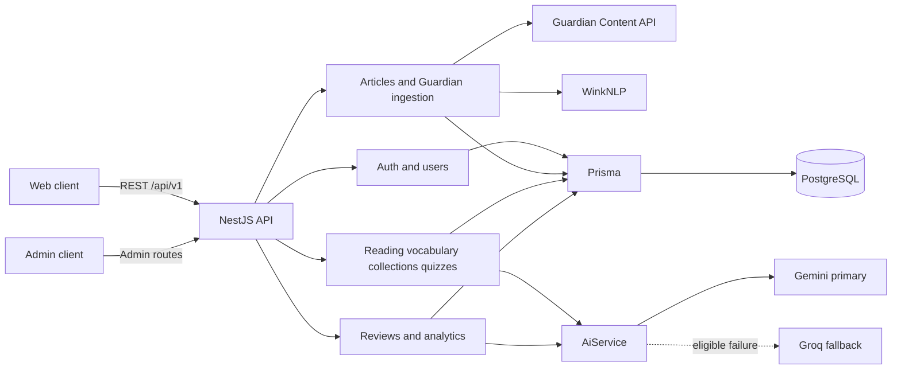
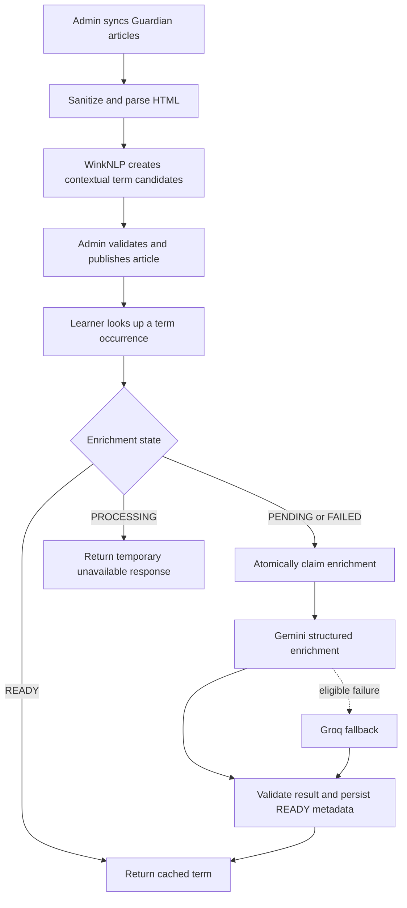
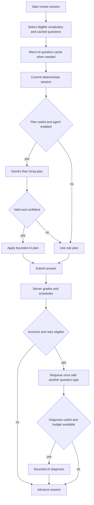
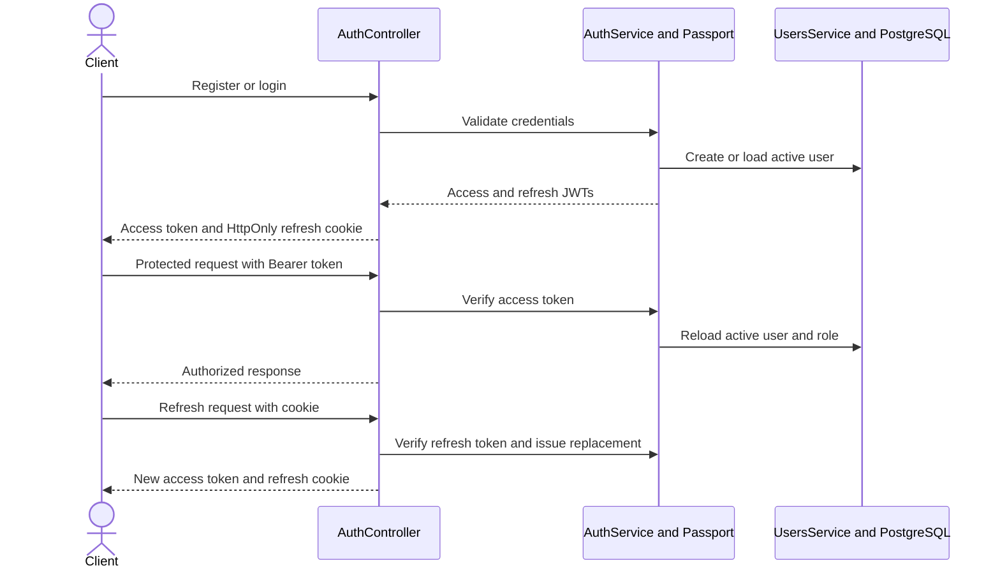

# 📚 Vocab Mate Backend

REST API for learning English vocabulary from news articles. It manages curated and Guardian-imported content, contextual vocabulary, quizzes, adaptive review sessions, and analytics.

The implementation combines deterministic learning rules with bounded LLM workflows: WinkNLP finds term occurrences locally; Gemini is the primary structured-output provider and Groq is the fallback.

## ✨ Highlights

- Versioned NestJS API with Swagger, DTO validation, JWT authentication, HttpOnly refresh cookies, and role guards.
- Admin content lifecycle: import, parse, analyze, moderate, publish, archive, and restore.
- Contextual vocabulary snapshots preserve the term, meaning, and sentence that a learner saved.
- AI review agent plans sessions and diagnoses useful wrong answers without owning grading or scheduling.
- PostgreSQL constraints, serializable transactions, and decision audits protect important learning-state invariants.

## 🧰 Stack

| Area | Technology |
| --- | --- |
| API | NestJS 11, TypeScript, Express, Swagger |
| Database | PostgreSQL, Prisma 7, `pg` |
| Auth | Passport JWT, BCrypt, HttpOnly cookies |
| AI | Google Gemini, Groq fallback, structured JSON validation |
| NLP and HTML | WinkNLP, `sanitize-html`, `htmlparser2` |
| Tests | Jest, Nest testing utilities, Supertest |

## 🏗️ Architecture



All routes use the `/api` prefix and URI version `v1`. Swagger is available at `/api/docs`, with OpenAPI JSON at `/api/docs-json`.

## 🤖 AI and content workflow



### Content intelligence

- Guardian discovery returns metadata; sync imports up to 10 items using the official `/search` endpoint with `fields.body`.
- HTML is sanitized, canonical URLs are normalized, and duplicate checks cover provider ID, URL, and content hash.
- `POST /admin/articles/:articleId/analyze` is local NLP, not an LLM call. It creates approved, sentence-contextual candidates with stable `data-term-id` markers.
- Published terms are enriched lazily on first lookup. The result includes Vietnamese contextual meaning and sentence translation, lexical data, and examples.
- Provider output is validated in application code. Raw provider output is neither logged nor stored.

### Review agent



- AI generates non-quiz review questions, can reorder a new session, and can recommend a bounded intervention after a useful incorrect answer.
- The server remains authoritative for ownership, eligibility, correctness, score, learning status, interval, and `nextReviewAt`.
- AI decisions are validated against allowed actions, confidence thresholds, session state, and atomic call budgets. Invalid, unavailable, disabled, or low-confidence calls fall back to an auditable rule decision.
- A review item can be retried once. Inferred scores range from 0 to 5; intervals range from 1 to 60 days.
- `AI_REVIEW_AGENT_ENABLED=false` disables planning and diagnosis only. Term enrichment and AI question generation remain available.

## 🔐 Authentication and authorization



- Access tokens are returned in JSON and accepted only from `Authorization: Bearer`.
- Refresh tokens are read from the `refreshToken` HttpOnly cookie, scoped to `/api/v1/auth`.
- Access and refresh tokens use separate secrets. Auth endpoints are throttled; refresh tokens are stateless and are not individually revoked server-side.
- `RolesGuard` enforces `USER` and `ADMIN` access. Admin changes prevent self-lockout and preserve at least one active administrator.

## 🗄️ Database

Prisma models are split by domain in `prisma/models/`.

| Domain | Core models |
| --- | --- |
| Identity | `User`, `UserProfile` |
| Content | `Category`, `Article`, `ArticleSentence`, `ArticleSentenceTerm` |
| Learning | `UserVocabulary`, `VocabularyCollection`, `UserArticleProgress` |
| Quiz | `Quiz`, `QuizQuestion`, `QuestionOption` |
| Review | `ReviewSession`, `ReviewSessionItem`, `ReviewAnswer`, `ReviewAgentDecision` |

Important rules:

- Vocabulary is contextual to an `article_sentence_term_id`, not a lemma. Saving it copies an immutable learning snapshot.
- `contentVersion` binds article HTML, sentence rows, and term markers. Parsing, publication, and enrichment reject stale work.
- The migration chain uses `pgcrypto`, `citext`, partial and expression indexes, checks, and `updated_at` triggers. Use migrations, not `prisma db push`.

## 📡 API areas

| Access | Routes |
| --- | --- |
| Public | `/auth`, `/categories`, `/articles` |
| Authenticated | `/users/me`, `/reading`, `/vocabularies`, `/collections`, `/quizzes`, `/reviews`, `/review-sessions`, `/analytics/me` |
| Admin | `/admin/users`, `/admin/categories`, `/admin/articles`, `/admin/news`, `/admin/quizzes`, `/admin/analytics` |

Most feature responses use `{ success: true, data }`; paginated endpoints add `meta`. API errors use `{ success: false, error }`.

## 📁 Project structure

```text
src/
  common/                    # Shared filters, interceptors, utilities
  config/                    # Validated application configuration
  database/                  # PrismaService
  modules/                   # Feature modules
    ai/ analytics/ articles/ auth/ categories/ collections/
    news-ingestion/ quizzes/ reading/ reviews/ users/ vocabularies/

prisma/
  models/                    # Multi-file Prisma schema
  migrations/                # Reviewed SQL migrations
  seed.ts

test/
  unit/                      # Unit specs mirroring src/
  e2e/                       # Supertest suites grouped by module
  support/                   # Shared mocks and in-memory repositories
```

## ⚙️ Environment

Copy `.env.example` to `.env`. Configuration is validated at startup, so all required AI and Guardian values must exist even when a related endpoint is disabled.

| Group | Variables |
| --- | --- |
| Database | `DATABASE_URL`, optional `DIRECT_URL` for Prisma migrations |
| App | `PORT`, `CORS_ORIGIN`, `ANALYTICS_TIMEZONE` |
| Auth | `JWT_ACCESS_SECRET`, `JWT_REFRESH_SECRET`, expiry values, `BCRYPT_ROUNDS`, cookie settings |
| AI | `GEMINI_API_KEY`, `GEMINI_MODEL`, `GROQ_API_KEY`, `GROQ_MODEL`, timeout and review-agent limits |
| News | `GUARDIAN_API_KEY` |

See [`.env.example`](.env.example) for required values and safe defaults.

## 🚀 Setup

Prerequisites: Node.js with npm, PostgreSQL with `pgcrypto` and `citext`, plus Gemini, Groq, and Guardian credentials.

```bash
npm ci
cp .env.example .env
# Complete .env, then:
npm run prisma:validate
npx prisma migrate deploy
npm run start:dev
```

On PowerShell, use `Copy-Item .env.example .env`.

Optional demo data:

```bash
npx prisma db seed
```

The seed creates deterministic content and an admin row with a deliberately unusable dummy password. Provision a usable administrator through a trusted operational process.

## 🧪 Scripts

| Command | Purpose |
| --- | --- |
| `npm run start:dev` | Start in watch mode |
| `npm run build` | Generate Prisma client and compile NestJS |
| `npm run prisma:validate` | Validate Prisma schema |
| `npm run prisma:generate` | Generate Prisma client |
| `npm test` | Run unit tests in `test/unit/` |
| `npm run test:e2e` | Run E2E tests in `test/e2e/` |
| `npm run prisma:verify-review-migrations` | Verify migrations in a disposable PostgreSQL schema |

## ⚠️ Operational notes

- Import, parsing, AI enrichment, and review AI calls run synchronously. There is no queue, scheduler, or automatic publication.
- Guardian throttling is process-local.
- `HealthModule` has no HTTP health-check handler.
- No Dockerfile or deployment manifest is included.

## 📄 License

Private package, `UNLICENSED`.
